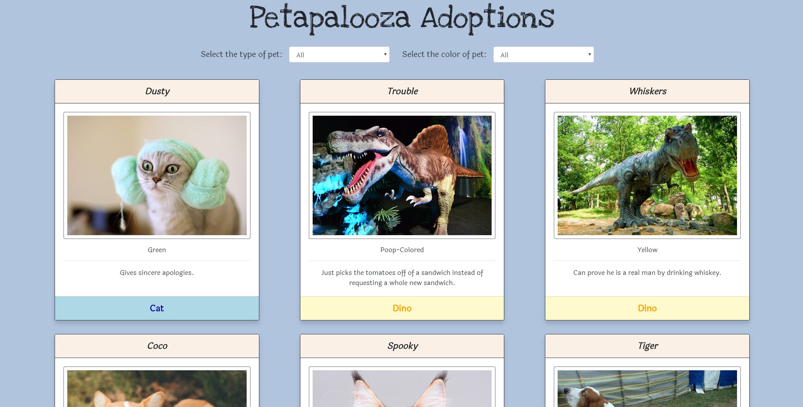
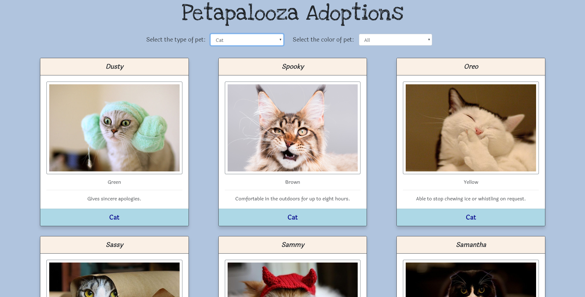
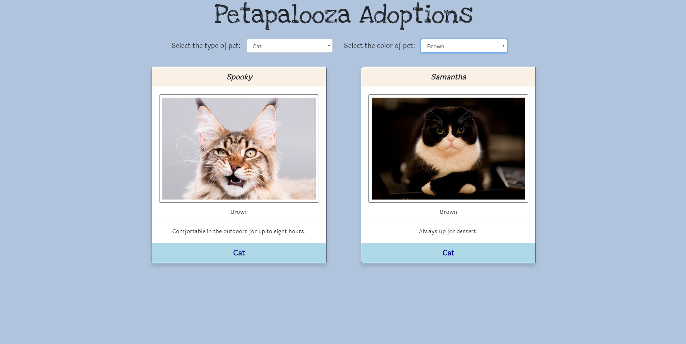

# Pet-Adoptions

With this project we were tasked with building a pet adoption website leveraging ES6 Modules and XHR requests to pull JSON data in from a file.

## Screenshots

### Home Page with NO Filter



### Home Page with TYPE Filter



### Home Page with TYPE & COLOR Filter



## Setup

**Your project should have (at least):**

```
|- db
    |- pets.json
|- javascripts
    |- events.js [Attaching all event listeners]
    |- main.js [Entry point/start application]
    |- components
        |- petComponent.js [Writing to the dom for the pet component]
    |- data
        |- petData.js [XHR call for pets.json]
|- index.html
|- main.css
```

**Install via CDN:**

- jQuery
- Bootstrap

## Requirements

- As a user, I want to see a listing of all available pets. Each pet should have a card that has all this data:

```
Image
Name: xxx
Color: xxx
Special Skill: xxx
Type of Pet: xxx
```

- As a user, I want to see 3 category(type) buttons printed at the top of the page. Each should be a different color. These can be hard-coded.
- I want to be able to click one of the 3 buttons, then only the cards that are in the category(type) should show.
- There should be some way for the user to unfilter the results.

## Tech Requirements

- You should be using Bootstrap; your project should look like the mockup displayed.
- You should be using ES6 modules.
- Your code should be clean and readable, with single responsibility principle.

## How to run this project

- Use npm to install http-server in your terminal:

```sh
npm install -g http-server
```

- Run the server

```sh
hs -p 8080
```

- Open your browser and navigate to:

```
localhost:8080
```
